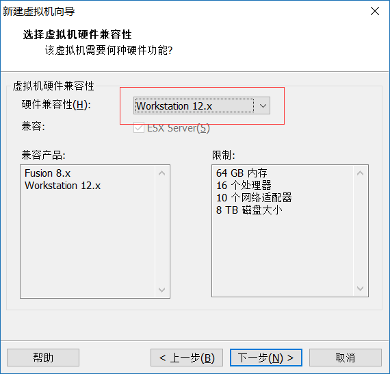
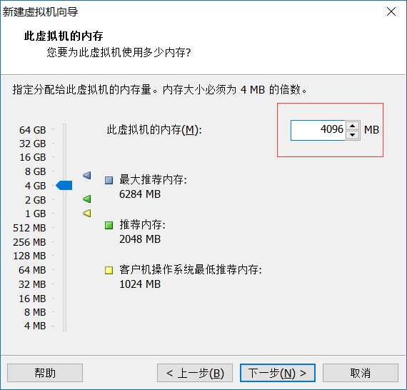
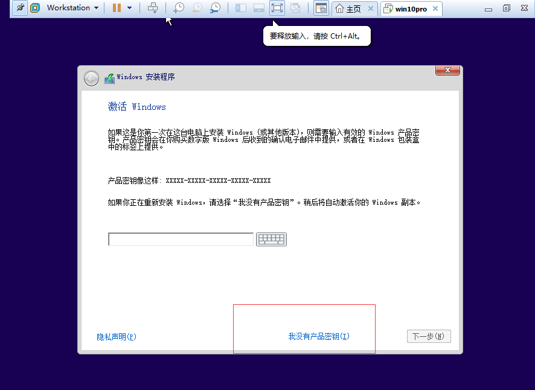
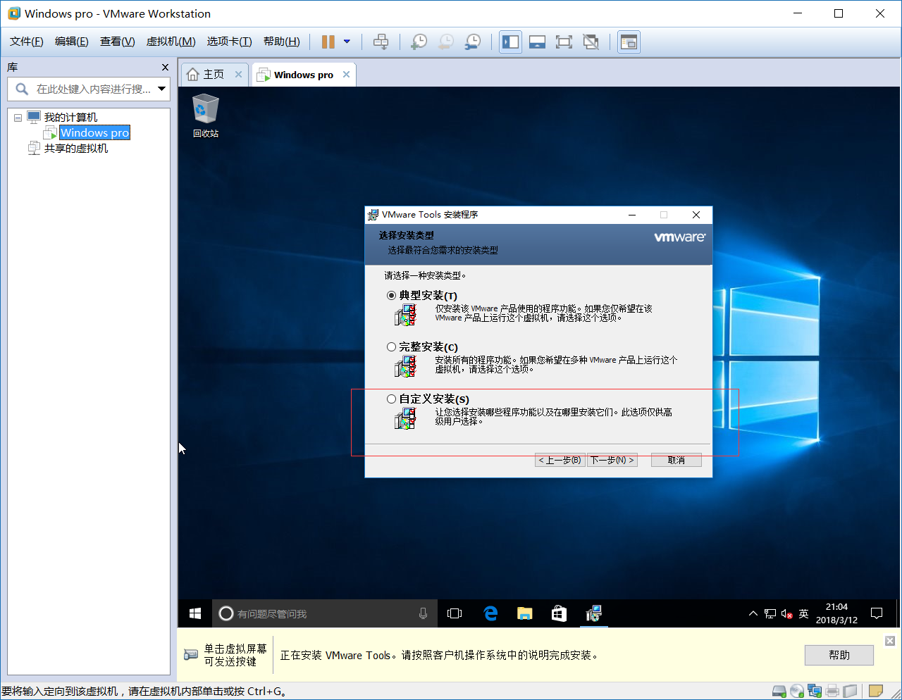
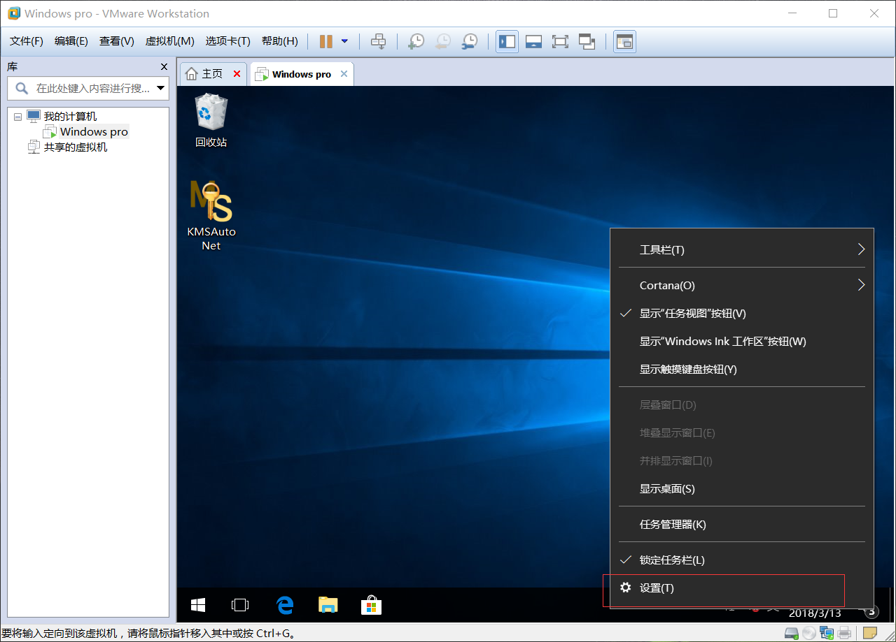

VMware-workstation
=
1：找到此文件
=
 

2:右键开始按钮找到命令提示符（管理员）
=
 
3:
=
 
4:
=
 
5:
=
 
6:
=
 
7:
=
 
8:
=
 
9:
=
 
10:
=
 
11:
=
 
12:
=
 
13:
=
 
14:
=
 
15:
=
 
16:
=
 
17:
=
 
18:
=
 
19:
=
 
20:
=
 
21:
=
 
22:
=
 
23:
=
 
24:
=
 
25:
=
 
26:
=
 
27:
=
 
28:
=
 
29:
=
 
30:
=
 
31:
=
 
32:
=
 
33:
=
 
34:
=
 
35:
=
 
36:
=
 
37:
=
 
38:
=
 
39:
=
 
40:
=
 
41:
=
 
42:
=
 
43:
=
 
44:
=
 
45:完成后点击应用。
=
 
46:
=
 
47:
=
 
48:
=
 
49:
=
 
50:
=
 
51:
=
 
52:
=
 
53:
=
 
54:
=
 
55:
=
 
56:
=
 
57:
=
 
58:
=
 
59:
=
 
60:
=
 
61:
=
 
62:
=
 
63:
=
 
64:
=
 
65:
=
 
66:
=
 
67:
=
 
68:
=
 
69:
=
 
70:
=
 
71:
=
 
72:
=
 
73:
=
 
74:
=
 
75:
=
 
76:
=
 
77:鼠标右键打开
=
 
78:
=
 
79:
=
 
80:鼠标右键打开
=
 
81:
=
 
82:鼠标右键打开
=
 
83:
=
 
84:
=
 
85:
=
 
86:
=
 
87:
=
 
88:
=
 
89:
=
 
90:
=
 
91:
=
 

